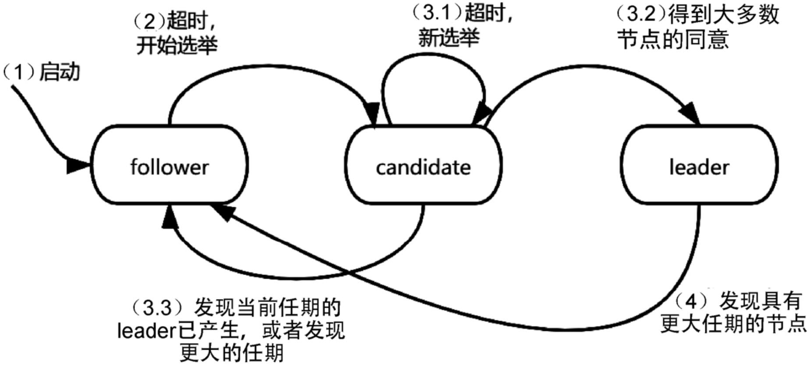
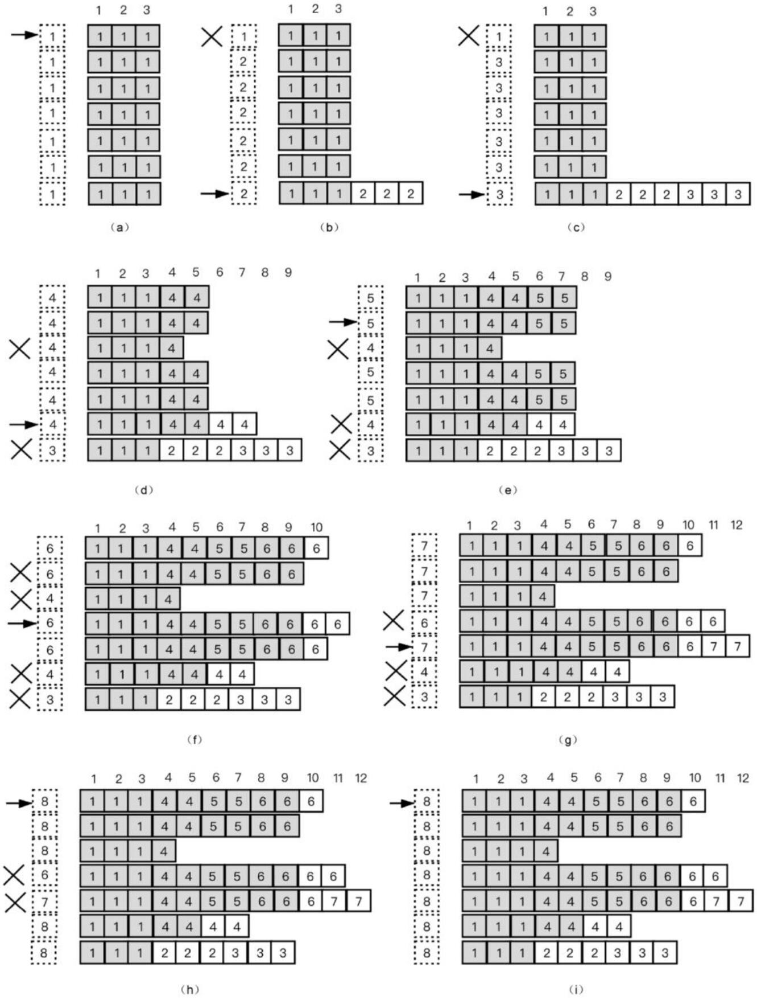
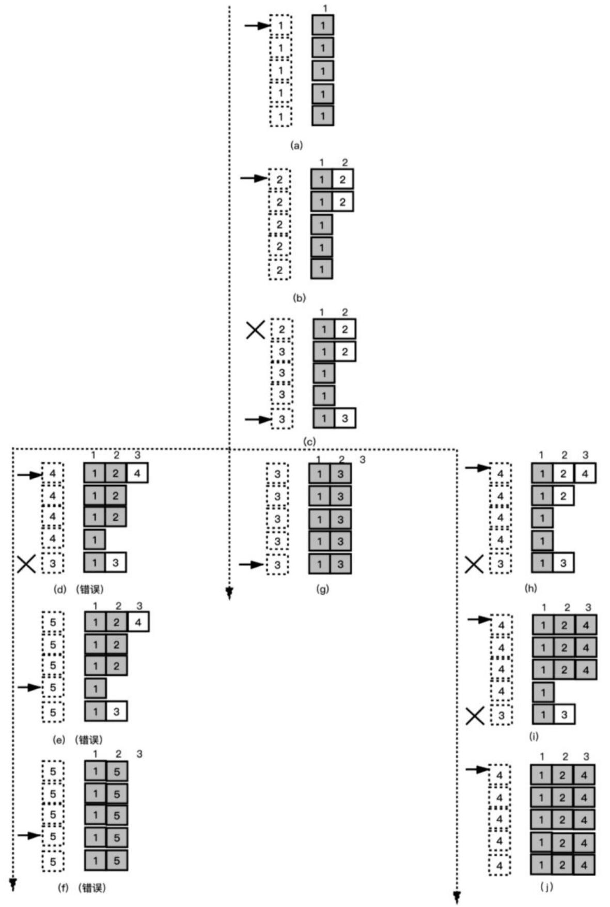

在分布式系统中还有一种常见复制状态机的抽象，就是把具有一定顺序的一系列action抽象成一条日志（log），每个action都是日志中的一个条目（entry）。如果想使每个节点的服务状态相同，则要把日志中的所有entry按照记录顺序执行一遍。所以复制状态机的核心问题就变成了让每个节点都具有相同的日志的问题，也就是把日志复制到每个节点上的问题。因此，这个问题也被称为复制日志（replicated log）问题。

**Raft**就是用来实现复制日志的一种算法，该算法会：
- 生成一条日志。
- 把这条日志复制到所有节点上。
- 把日志的entry应用到状态机上。

每个状态机都以相同的顺序执行相同的命令，最终每个状态机都会达到相同的状态。Raft实现了节点之间的复制日志，每条日志的内容就是一个命令。

总体来说，Raft算法可以分解为复制、选举、异常处理三个部分。

1. Raft算法的所有节点中会有一个节点作为领导者（leader），其他非leader的节点被称为跟随者（follower）。leader负责接收客户端的请求，根据请求生成日志，把日志复制到所有节点上，并且判断是否适合把日志应用到状态机中。我们将这个过程称作**复制（replication）过程**。

2. 除了复制过程，Raft还包括一部分：如果leader发生宕机等异常情况，其他节点需要成为新的leader，继续履行leader的职责。我们将这个过程称作**选举（election）过程**。

3. 此外，在选举后，还需要处理异常带来的各种影响，也就是进行**异常处理**。

Raft采用RPC（Remote Procedure Call，远程过程调用）实现节点间的通信，包括复制过程、选举过程和异常处理都通过RPC来实现。

### 复制过程
（1）当leader收到客户端的请求后，它会将这个请求作为一个entry记录到日志中。leader会将新entry记录到日志的最后，或者说追加到末尾（append）。日志中的每个entry都有一个索引（index），index是一个连续的整数，每追加一个entry，index就会加1。

（2）leader在完成append操作后，会并行向所有的follower发起AppendEntries RPC，follower收到AppendEntries调用后，将请求中的entry追加到自己的本地日志中，并回复leader成功。

（3）leader收到大多数follower的成功回复后，这个entry就被leader认为达到提交（committed）状态，leader将这个entry应用到状态机中，并且leader会回复客户端这次请求成功。对于没有回复的follower，leader会不断地重试，直到调用成功。

此时，follower只是把这个entry追加到日志中，并没有应用到状态机中。Raft在下面两个时机会通知follower这个entry已经处于committed状态。

- 当leader处理下一个客户端的请求时，leader会将下一个entry复制到所有follower的请求中，带上committed状态的entry的index，follower将下一个entry追加到日志中，同时会将这个entry应用到状态机中。

- 如果暂时没有新的客户端请求，则Raft会将committed状态的entry的index信息随着心跳发送给所有follower。

当follower通过上面两种方式知道entry已经提交后，它会把entry应用到状态机中。

这样的复制过程有一个特性：即使少数节点变慢或者网络拥堵，也不会导致这个过程变慢。

### 选举过程
如果出现诸如leader发生宕机这样的情况，则需要从follower中选出一个新的leader，也就是执行选举过程。
#### 选举条件
具体来讲，发生选举的条件是：在一定的时间内，没有收到leader的日志复制请求，包括心跳请求，即发生超时（timeout）。

如果上面的条件满足了，则节点会进入candidate状态，candidate是处于candidate状态的节点，也就是想要成为leader的节点。相对应地，leader是处于leader状态的节点，follower是处于follower状态的节点。

candidate会给其他所有的节点发送投票请求（通过RequestVote RPC），要求其他节点同意自己成为新的leader。

收到投票请求的follower，会检查这个candidate是不是符合条件：candidate的index要比自己的大。

如果满足这个条件，则回复同意；如果不满足，则回复不同意。如果candidate得到大多数follower同意的话，那么它就顺利成为新的leader。

#### 任期
**问题一**：所有follower都发现leader宕机，因此都转变为candidate，多个candidate抢夺leader的地位。因为多个candidate同一时刻发起投票，瓜分了follower（每个follower只能投一个candidate），甚至大家都是candidate，没有follower。多个candidate都想成为leader，剩下处在follower状态的节点形成不了大多数，这时candidate会一直等待，直到超过一定时间后，最后选举失败。为了选出新的leader，需要重新选举，并区分新旧选举的请求。

**问题二**：除了发生leader宕机，还有其他情况要处理。比如leader宕机后又恢复了，发生网络分区，这种情况要比leader宕机复杂，因为在宕机恢复和网络分区恢复后，集群中可能会出现两个leader，也就是出现脑裂问题。我们需要区分出新旧两个leader，并且阻止旧的leader参与集群活动。

Raft采用任期（term）来解决上面的两个问题。每个节点都用一个整型数字来保存任期，每次开始新的选举，任期都加1。

从全局逻辑来理解，在Raft中，时间被分为很多个任期，每个任期都从一次选举开始。如果一个candidate在选举中获胜，那么在这个任期内，这个candidate将成为leader。如果没有leader被选出，则开始一个新的任期，重新进行选举。

**“问题一”的解决**
假如有两个节点A和B，它们的任期都为1，这两个节点都转变为candidate，开始选举，两个candidate都没有达到大多数同意，这时节点A先发生超时，节点A会把它的任期加1，成为2，重新开始一次选举。各节点都会无条件优先接受更大的任期的请求，所以节点A这次会得到大多数节点的同意，成功成为leader。

但是存在一种特殊的情况，就是节点A和B同时开始选举，都没有达到大多数同意，节点A和B同时超时，又同时开始新的选举，又都没有达到大多数同意，又同时失败，这样就会反复地进行下去，没有休止。Raft通过一种非常简单的方法解决了这个问题，就是在选举失败后、开始新的选举前，随机等待一段时间（这种方法被称为**随机回退**），那么节点A和B再次同时开始选举的可能性就大大降低了。

然而，采用随机回退方法仍然可能存在一种特殊的情况，就是节点A被选举成为leader，节点B在选举中失败，节点B把自己的任期加1，开始新的选举，成功地成为leader，节点A连续两次新的选举后，以更大的任期成为新的leader，节点B也再次连续两次新的选举后成为新的leader，节点A和B就这样无限地循环下去。虽然出现这种情况的可能性非常小，但是理论上是存在的，称之为**活锁**。在实际中这种情况发生的概率很小，所以会被忽略不计。

**“问题二”的解决**
leader的任期会被包含在所有的请求（包括复制请求和心跳请求）中，其他节点收到请求，如果请求中的任期比自己的大，则用请求中的任期更新自己的任期，在选举结束后，所有节点的任期最终都会统一成leader的任期。如果收到的请求中的任期比自己的小，则会拒绝这个请求。

对于leader宕机后又恢复或者网络分区恢复这样的情况，由于联系不上leader，follower会转变成candidate，把自己的任期加1，开始选举，并且成为新的leader，新的leader具有更大的任期，所有投票给新的leader的节点的任期和leader的任期是一样的。当leader宕机恢复或者网络分区恢复后，旧的leader仍然在运行，但是它给其他节点发送请求不会形成大多数，因为大多数节点都具有更大的任期。一旦新的leader发送请求给旧的leader，旧的leader就会发现有更大的任期存在，它会主动转变为follower，并且更新自己的任期为新的leader的任期。

#### 完整的选举过程
完整的选举过程如下图所示：

<!--  -->

1. 节点启动时处于follower状态。
2. 该节点在一段时间内没有收到任何请求，则发生超时，其转变为candidate。
3. candidate增加自己的任期，开始新的选举，向所有节点发送投票请求。candidate发出投票请求后，会有三种结果：
    - 没有得到大多数节点的同意，本次选举超时，开始新的选举。
    - 得到大多数节点的同意，成为新的leader。
    - 收到其他节点的请求，其任期与自己的相同，说明其他candidate已经在这次选举中得到大多数follower的同意，成为leader，这时这个candidate会退回到follower状态；或者请求中包含更大的任期，这个candidate也退回到follower状态。
4. 在leader收到的请求中包含更大的任期，leader转变为follower状态。

### 异常处理
选举过程，虽然使集群从leader宕机和网络分区中恢复回来，重新选出了新的leader，但是这些异常情况已经给集群带来了影响，导致各节点上的数据不一致。

### 不一致异常

### 一致性检查
Raft算法强制要求所有follower保持与leader一致，也就是说，不一致的部分要丢弃，替换成leader相应的部分。所有已提交的entry都会被包含在leader中，强制follower保持与leader一致，就是强制follower把缺少的已提交的entry补齐；而对于没有提交的entry，因为还没有给客户端回复ack，所以既可以按照成功处理，也可以按照不成功处理——按照成功处理就是保留，按照不成功处理就是丢弃。Raft算法的策略是新的leader上所有未提交的entry保留，其他节点上未提交的entry丢弃。

Raft算法通过名为一致性检查（consistency check）的过程强制follower保持与leader一致。虽然这个过程的名字叫检查，但其实可以认为它是一个恢复的过程。

新的leader并不会专门启动一个一致性检查的过程。当leader发起AppendEntries RPC发送一个新entry时，会在请求中包含新entry前面一个entry的index和任期，如果follower在自己的日志中没有找到对应的index和任期，则拒绝这个新entry。如果leader发现AppendEntries调用失败，则把前一个entry通过AppendEntries发送给follower；如果还失败，则发送再往前一个entry，直到AppendEntries调用成功。如果AppendEntries调用成功，则说明leader和follower的日志已经达到一致的状态，leader从这个entry开始往后逐个调用AppendEntries。

### 不提交旧的leader的entry
leader会保留未提交的entry，但是需要注意的是，新的leader并不会试图提交这些未提交的entry，而是继续追加新entry，当新entry达到提交状态时，则会自动提交前面未提交的entry。

